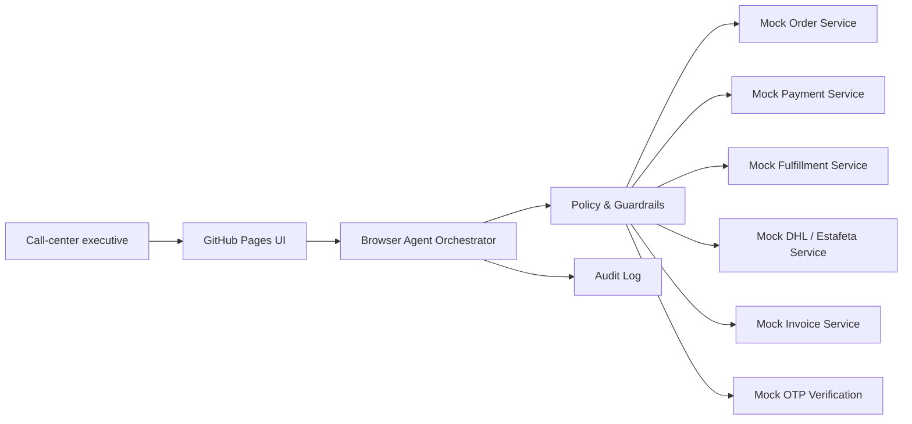
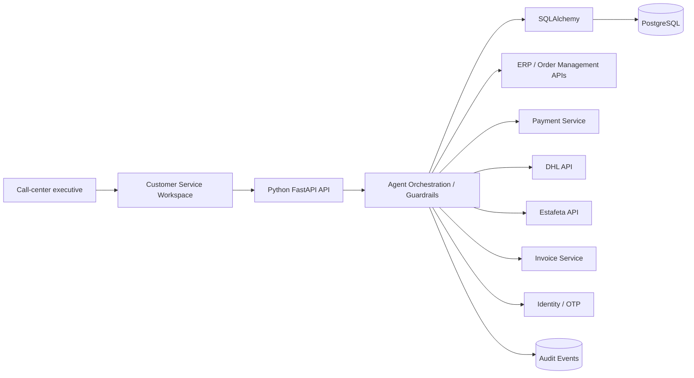

# AI Customer Service Agent for Order-to-Delivery Operations

> **Portfolio project — Senior IT Project Manager / AI Technical Project Manager**
>
> Business objective: reduce customer-service resolution time from approximately **4 days to same-day service** by giving call-center executives a governed AI-assisted workspace across order, payment, pickup, delivery, and invoice workflows.

## Live demo

**Custom domain:** https://order-agent.ai4good.mx/

This repository includes a **zero-cost GitHub Pages demo** that uses synthetic data and simulated enterprise tools. It intentionally does **not** expose real customer data, credentials, payment data, or carrier accounts.

The public demo showcases:

- Secure order-number recovery when the customer does not know the order number
- Identity verification with simulated OTP
- Order status lookup
- Payment-registration confirmation
- Store-pickup readiness
- DHL / Estafeta delivery tracking simulation
- Estimated time of arrival
- Invoice availability and simulated send action
- Human-in-the-loop escalation
- Tool-call trace and audit log
- Operational KPI dashboard

## Why this project matters

The use case is not "a chatbot." It is an **AI-enabled order-to-delivery operating model**. The agent interprets the representative's request, selects approved tools, retrieves authoritative transactional facts, applies disclosure rules, and provides a concise answer to the call-center executive.

The LLM/agent is **not the system of record**. Orders, payments, fulfillment, shipments, invoices, and identity verification remain deterministic services.

## Business scenario

Customer-service executives frequently need to answer:

- "What is my order number?"
- "Has my payment been registered?"
- "Can I pick up my order in store?"
- "Where is my shipment?"
- "When will it arrive?"
- "Can you send me my invoice?"

The legacy workflow can require coordination across ERP, finance, warehouse/store teams, carriers, and invoicing. The target workflow consolidates those checks into an authorized agent interaction.

## Demo architecture vs. target enterprise architecture

### Zero-cost public demo



All data is synthetic. No API keys or paid cloud services are required.

### Target enterprise implementation



**Target stack:** Python, FastAPI, SQLAlchemy, PostgreSQL, REST APIs, role-based authorization, audit logging, and an LLM/tool-calling layer where appropriate.

## Security design

The agent may identify candidate orders, but **authorization controls disclosure**.

Purchased items are useful matching signals but are **not sufficient authentication**. Before disclosing protected order details, the flow requires stronger verification such as a one-time code to a registered phone/email or an authenticated customer account.

The demo implements: data minimization, simulated OTP verification, restricted disclosure before verification, tool allow-listing, human escalation, and auditable agent/tool actions.

See [Security & AI Governance](docs/SECURITY.md).

## Demo scenarios

1. **Recover an unknown order number** — “I ordered a Samsung monitor and keyboard last week but I don't know my order number.”
2. **Confirm payment** — “Has payment for order TVC-483921 been registered?”
3. **Store pickup** — “Can the customer pick up TVC-483921 today?”
4. **Delivery ETA** — “Where is order TVC-392187 and when will it arrive?”
5. **Invoice** — “Send the invoice for TVC-392187.”

## KPIs

| KPI | Baseline / Goal |
|---|---|
| Average service resolution time | ~4 days → same day |
| First-contact resolution | Increase |
| Same-day resolution rate | Increase |
| Order-recovery success | Increase |
| False customer/order match | Minimize |
| Tool-call success | Increase |
| Escalation rate | Monitor / reduce appropriately |
| Unsupported response rate | Target near zero |
| Unauthorized disclosure incidents | Target zero |

## Senior IT Project Manager scope

This project is presented from the delivery-leadership perspective:

- Business-case definition and KPI baseline
- Order-to-delivery process discovery
- Stakeholder alignment across Customer Service, E-commerce, Finance, Warehouse, Logistics, IT, Security, and IAM
- MVP backlog and prioritization
- Integration/dependency management
- Architecture governance
- AI risk and control design
- Pilot planning and adoption
- Operational readiness
- KPI instrumentation and benefits realization

See [Senior IT Project Manager Delivery View](docs/PROJECT-MANAGEMENT.md).

## Repository structure

```text
.
├── index.html
├── styles.css
├── app.js
├── demo/data/orders.json
├── docs/
│   ├── ARCHITECTURE.md
│   ├── PROJECT-MANAGEMENT.md
│   ├── SECURITY.md
│   ├── DEMO-SCRIPT.md
│   └── ROADMAP.md
├── backend-reference/
│   ├── requirements.txt
│   └── app/
│       ├── main.py
│       ├── models.py
│       └── database.py
└── .github/workflows/pages.yml
```

## Run locally

```bash
python -m http.server 8000
```

Open http://localhost:8000.

### Reference API

By default the reference backend runs with local SQLite; set `DATABASE_URL` to a PostgreSQL URL to use PostgreSQL.

```bash
cd backend-reference
python -m venv .venv
# Windows: .venv\Scripts\activate
# macOS/Linux: source .venv/bin/activate
pip install -r requirements.txt
uvicorn app.main:app --reload
```

## Deploy to GitHub Pages

The included workflow publishes the static demo.

1. Open **Settings → Pages**.
2. Set **Source** to **GitHub Actions**.
3. Push to `main` or manually run the Pages workflow.

## Disclaimer

This is a portfolio demonstration using synthetic data. It is not connected to TVC, DHL, Estafeta, or any production system, and does not represent or expose confidential implementation details.
